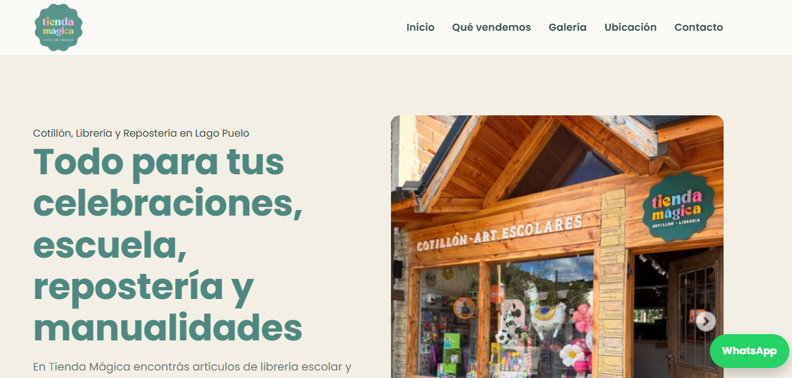

🇪🇸 Español | 🇬🇧 English

# Tienda Mágica Website

Sitio web creado para **Tienda Mágica**, un comercio local que vende artículos escolares, cotillón, manualidades y materiales para decoración.

Este proyecto fue desarrollado como una **web real para un cliente** y se encuentra desplegado utilizando **Netlify**.

---

## 🌐 Sitio Web

https://tienda-magica-lago-puelo.netlify.app/

---

## 🚀 Tecnologías Utilizadas

- HTML5  
- CSS3  
- JavaScript  
- Netlify (deploy)

---

## 📸 Vista del Sitio

---

## 📂 Estructura del Proyecto

tienda-magica-web
│
├── index.html
├── css/
├── js/
├── images/
└── admin/ (configuración del CMS)

---

## ✨ Funcionalidades

- Diseño responsive
- Galería de productos
- Sección de contacto
- Botón de contacto directo por WhatsApp
- Galería de imágenes del local

---

## 📦 Deploy

El sitio se encuentra desplegado en **Netlify** y conectado con **GitHub** para realizar **deploy automático**.

Cada actualización enviada a la rama `main` genera automáticamente una nueva publicación del sitio.

---

## 👩‍💻 Autora

**Barbara Bernhard**

Licenciada en Turismo | Estudiante de Desarrollo Web | QA Tester

__________________________________________________________________________________________________________________________

# Tienda Mágica Website

Website created for **Tienda Mágica**, a local shop that sells school supplies, party items, crafts and decoration materials.

This project was developed as a real client website and deployed using Netlify.

## 🌐 Live Website

https://tienda-magica-lago-puelo.netlify.app/

## 🚀 Technologies Used

- HTML5
- CSS3
- JavaScript
- Netlify (deployment)

## 📸 Website Preview

## 📂 Project Structure

tienda-magica-web
│
├── index.html
├── css/
├── js/
├── images/
└── admin/ (CMS configuration)

## ✨ Features

- Responsive layout
- Product gallery
- Contact section
- WhatsApp contact button
- Image gallery for store products

## 📦 Deployment

The website is deployed on **Netlify** and connected to GitHub for continuous deployment.

Any update pushed to the `main` branch automatically triggers a new deploy.

## 👩‍💻 Author

Barbara Bernhard  
Tourism Professional | Web Development Student | QA Tester
