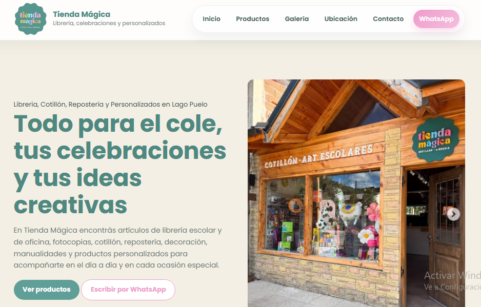

🇪🇸 Español | 🇬🇧 English

# ✨ Tienda Mágica Website

<p align="center">
  
</p>

<p align="center">
  Sitio web publicado para Tienda Mágica, comercio local de Lago Puelo, Chubut.
</p>

<p align="center">
  <a href="https://tiendamagica.netlify.app/" target="_blank"><strong>🔗 Ver web online</strong></a>
</p>

---

## 🇪🇸 Español

**Tienda Mágica** es un sitio web desarrollado y publicado para un comercio local dedicado a librería, fotocopias, cotillón, repostería y productos personalizados.

El objetivo del proyecto fue crear una presencia digital clara, cálida y visualmente atractiva para presentar el negocio, sus categorías de productos, servicios, ubicación y canales de contacto. El sitio cuenta con una estructura responsive adaptada a computadoras, tablets y dispositivos móviles.


### 🚀 Tecnologías utilizadas
- **HTML5**
- **CSS3**
- **JavaScript**
- **Netlify** para deploy

### ✨ Funcionalidades
- Diseño responsive
- Hero principal con llamada a la acción
- Sección de categorías con interacción visual
- Galería de imágenes del local y productos
- Sección de ubicación con acceso a Google Maps
- Contacto directo por WhatsApp e Instagram
- Deploy automático desde GitHub a Netlify

### 📂 Estructura del proyecto
```bash
tienda-magica-web/
├── index.html
├── css/
├── js/
├── imagenes/
└── admin/
```
---

## 📦 Deploy

El sitio se encuentra desplegado en **Netlify** y conectado con **GitHub** para realizar **deploy automático**.

Cada actualización enviada a la rama `main` genera automáticamente una nueva publicación del sitio.

---

## 👩‍💻 Sobre este proyecto

Este sitio fue desarrollado como un proyecto real para fortalecer la presencia digital de Tienda Mágica y facilitar el acceso de sus clientes a la información del comercio.

El proyecto incluyó:

- Organización y adaptación del contenido
- Diseño visual responsive
- Presentación de productos y servicios
- Integración con WhatsApp, Instagram y Google Maps
- Optimización de la navegación en dispositivos móviles
- Configuración del despliegue automático mediante GitHub y Netlify
- Publicación y mantenimiento del sitio

---
## 👩‍💻 Autora

**Barbara Bernhard**

Licenciada en Turismo | Frontend Developer | Técnica en Programación | QA Tester

__________________________________________________________________________________________________________________________
## 🇬🇧 English

**Tienda Mágica** is a published website developed for a local business specializing in stationery, photocopy services, party supplies, baking supplies and personalized products.

The goal of the project was to create a clear, warm and visually appealing digital presence to showcase the business, its product categories, services, location and contact channels. The website provides a responsive experience across desktop, tablet and mobile devices.


🚀 Technologies used

- HTML5
- CSS3
- JavaScript
- Netlify for deployment

✨ Features

- Responsive design
- Main hero section with call to action
- Category section with visual interaction
- Store and product image gallery
- Location section with Google Maps access
- Direct contact through WhatsApp and Instagram
- Automatic deployment from GitHub to Netlify

📂 Project structure
```bash
tienda-magica-web/
├── index.html
├── css/
├── js/
├── imagenes/
└── admin/
```

📦 Deployment

The demo project is deployed on Netlify and connected to GitHub for automatic publishing.

Any update pushed to the main branch triggers a new deployment.

👩‍💻 About this project

This site was developed as a demo web proposal, applying principles of:

responsive design

visual structure

content organization

user experience

live deployment

## 👩‍💻 Author

Barbara Bernhard  
Licenciada en Turismo | Frontend Developer | Técnica en Programación | QA Tester
